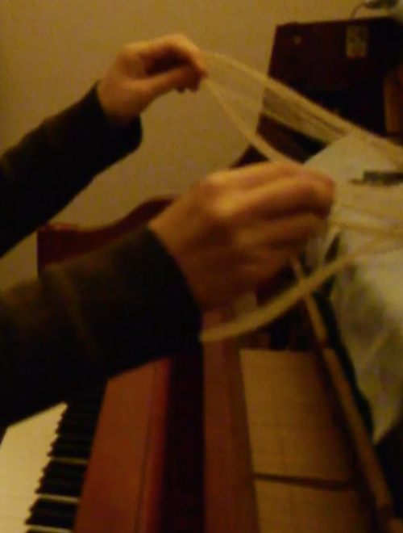

<!--[About](post/aboutcv.md) -->
[News](post/news.md) 
[Buy](post/buy.md) 
[Materials](post/materials.md)  
<!--[Project Links](post/pl.md)  -->

  

Jiyeon Kim is musician, playing her own compositions for piano and electronics. Jiyeon first practiced how to adopt fieldrecording as creative practices to discover sonic textures, performing at venues like cafe oto(london), Ausland(berlin), stazione di topolo(italy), etc. She was mentored by Touch(UK) and her practice was covered in <Experimental music since 1970> by Jennie Gottschalk(Bloomsbury, 2016). These sonic crafts followed by extensive composition practices and material exploration centered around piano. Her present projects are instrumental project 11 (piano solo) and 11 min (piano-drum duo). Her album was nominated for Korean Music Award 2018 under Jazz and Crossover category.

<!---[Jiyeon Kim---*music project, performance*](post/jiyeonkim.md) 
[11---*performance, records*](post/11.md) 
[11min---*performances, records*](post/11min.md) 
[weather report---*radio, publication, installation, camp*](post/weatherreport.md) 
[Transparent Music---*performances, records, publication, screening*](post/tm.md) --->

[11](https://www.youtube.com/channel/UC8g_qroBglkYoYbaGvckFdQ?view_as=subscriber) 
[11min](https://tumblbug.com/11min_vinyl) 
[weather report](https://vimeo.com/user98689565)  

instagram: [@11_musician](https://instagram.com/11_musician) [@jiyeonkimsound](https://instagram.com/jiyeonkimsound) 
facebook: [@11.weathermusic](https://www.facebook.com/11.weathermusic/) 
email: teum11@gmail.com 

